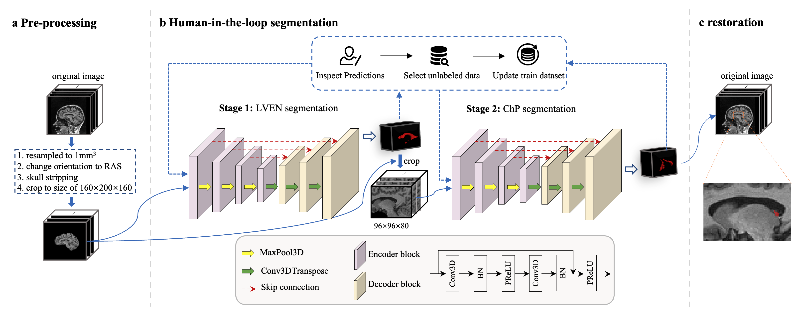

# Choroid plexus (ChP) segmentation pipeline for T1-weighted magnetic resonance images
**Updated on August 3, 2025.**
This pipeline was enhanced in the [paper](https://doi.org/10.1016/j.neuroimage.2025.121392) published at **NeuroImage**.

This is the pipeline which proposed in the [paper](https://doi.org/10.1186/s12987-024-00554-4) published at **Fluids and Barriers of the CNS**. In this repository, we offer two methods to execute the ChP segmentation pipeline. One method involves directly executing the Python code, while the other method utilizes Docker.


---
## Usage
#### Input/Output formats
- The following **input** forms are accepeted:
1. Single NIfTI file (`.nii` or `.nii.gz`)
2. folder containing `.dcm` series
3. folder containing multiple NIfTI files
4. `.txt` file where each row contains the NIfTI file path
- **Output**, Defualt path: `resluts/`, you can specify custom path. [Jump to Output files structure](#outputs-structure)

### Option 1: Using Docker （Recommend）

#### Pull the Image
```bash
docker pull batjoker1/chp-seg:v2
```
#### Run the Container
- **CPU Version:**
```bash
docker run -v $OUTPUT_FOLDER_ON_HOST:/app/results -v $DATA_PATH_ON_HOST:$DATA_PATH_IN_CONTAINER -it --rm batjoker1/chp-seg:v2 bash
```
- **GPU Version (requires NVIDIA driver support):**
```bash
docker run --gpus all -v $OUTPUT_FOLDER_ON_HOST:/app/results -v $DATA_PATH_ON_HOST:$DATA_PATH_IN_CONTAINER -it --rm batjoker1/chp-seg:v2 bash
```

#### **Run Inference**
Once inside the container, run:
```bash
python pipeline.py --input File/Directory
```

### Option 2: Python source code
#### Environment Requirements  
Ensure that TensorFlow >2.4 is installed. Then, install the required packages listed in `requirements.txt` (no strict version requirements) and Deepbrain (`pip install deepbrain --no-deps`).

#### Installation & Setup  
Clone the repository and navigate to the project directory:  
```bash
git clone https://github.com/princeleeee/ChP-Seg.git
cd ChP-Seg
```

Modify the DeepBrain package to enable TensorFlow 1.x compatibility. This is necessary because DeepBrain was originally implemented with TensorFlow 1.x. See the related [issue](https://github.com/iitzco/deepbrain/issues/6#issuecomment-620831557) for more details.

For example, in my case I run the following command to enable TensorFlow 1.x compatibility: 
```bash
sed -i '1s/.*/import tensorflow.compat.v1 as tf/' /usr/local/lib/python3.8/site-packages/deepbrain/extractor.py # Necessary since Deepbrain is accomplished with Tensorlow 1.x
```
You can change in the similar way according to your own environment.

#### Download Model Weights
Download the pre-trained deep learning model weights from [Google Drive](https://drive.google.com/drive/folders/1UHDt0jR4tI9jkskoJWX6E-DdbMk25AR5?usp=drive_link) and place them in the weights folder:

```
mkdir weights
```
#### Run Inference
Once everything is set up, you can run the pipeline on a sample input:
```
python pipeline.py --input demo/I812923.nii.gz  # Example run
```

---
## Outputs structure
```
Results/
├── file_collections.txt # all files input to the pipeline.
│
├── brain/  # save the results in the preprocessing and skull stripping stage.
│   │
│   ├── 0_resample/ # 1mm^3 RAS+ reorientation and resampled images save path.
│   │   ├── crop_range.txt
│   │   └── xxx.nii.gz
│   │
│   ├── 1_check/ # 3 plane .png check the crop option on 0_resample
│   ├── 1_err/ # 3 plane .png check the crop option on 0_resample
│   ├── 1_img/ # cropped skull stripped images from 0_resample, size: 160*200*160, crop range records is brain/0_resample/crop_range.txt
│   ├── 1_mask/ # brain mask on 1_img
│   │
│   └── 2_resample_inverse/ # restore images in 1_img to original image space.
│
├── ventricle/  # ventricle segmentation results folder
│   │
│   ├── 0_mask/ # segmentations resluts of lateral ventricles, size: 160*200*160
│   │
│   ├── 1_img_crop/ # crop brain/1_img to size 96*96*80
│   ├── 1_mask_crop/ # crop ventricle/0_mask to size 96*96*80
│   │
│   ├── 2_resampledT1_space/ # restore ventricle segmentation mask that matches brain/0_resample
│   │
│   ├── 3_orig_T1_space/ # restore ventricle segmentation mask that matches brain/2_resample_inverse
│   │
│   └── crop_range.txt  # crop range records that generated ventricle/1_img_crop and ventricle/1_mask_crop
│
└── cp/ # choroid plexus segmentation resluts folder
    │
    ├── 0_mask/ # segmentation results of choroid plexus, size 96*96*80
    │
    ├── 1_mask_refine/ # refined segmentaiton results of cp/0_mask
    │
    ├── 2_resampledT1_space/ # ChP segmentation match images in brain/0_resample
    │
    └── 3_orig_T1_space/ # ChP segmentation match images in brain/2_resample_inverse
```


## Citation
If you find our work helpful, please consider citing:
```bibtex
@article{li2024associations,
  title={Associations between the choroid plexus and tau in Alzheimer’s disease using an active learning segmentation pipeline},
  author={Li, Jiaxin and Hu, Yueqin and Xu, Yunzhi and Feng, Xue and Meyer, Craig H and Dai, Weiying and Zhao, Li and Alzheimer’s Disease Neuroimaging Initiative},
  journal={Fluids and Barriers of the CNS},
  volume={21},
  number={1},
  pages={56},
  year={2024},
  publisher={Springer}
}

@article{LI2025121392,
title = {Morphological changes of the choroid plexus in the lateral ventricle across the lifespan: 5551 subjects from fetus to elderly},
journal = {NeuroImage},
volume = {318},
pages = {121392},
year = {2025},
issn = {1053-8119},
doi = {https://doi.org/10.1016/j.neuroimage.2025.121392},
url = {https://www.sciencedirect.com/science/article/pii/S1053811925003957},
author = {Jiaxin Li and Yuxuan Gao and Yunzhi Xu and Weiying Dai and Yueqin Hu and Xue Feng and Dan Wu and Li Zhao}
}
```
